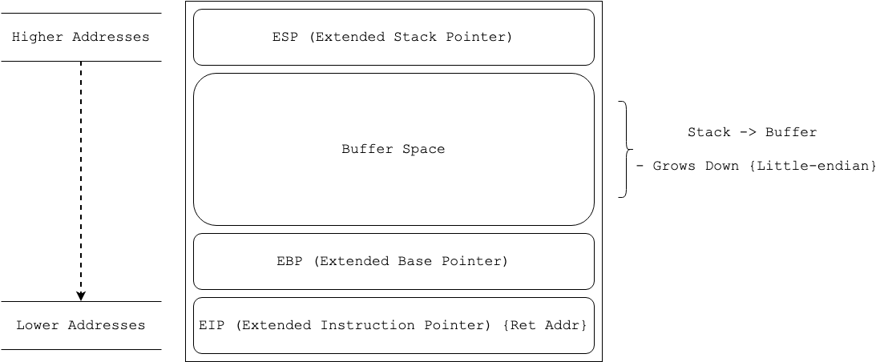

Buffer Overflows
================


## Overview

Buffer Overflows are a type of binary exploitation which arise from poor programing practices && memory allocation in memory managed programing languages like C. They are an example for a 'mixing data && control' vulnrability.

## Occurance

Buffer Overflow vectors/vulnrabilities commonly arise when:

- User data is collected with an unprotected function like `gets()`
- A function or section of code within a program assumes a prameter or variable is of suitible length for the allocated memory
- A length/buffer check is bypassed 


# Theory

## Memory for Buffer Overflows

### Anatomy of Memory


### Anatomy of the Stack

~ Note diagram assumes little-endian addressing




## Executing a Buffer Overflow

### Objectives

#### Broad objectives:

+ Inject input into a vulnerable program such that the buffer space allocated for the input is overwritten
+ Overflow the EBP and reach the EIP by varying the injected string
+ Overwrite the EIP with the memory location of arbitary code to achieve arbitary code execution


### Approach

#### General Steps to pop a shell:

~ Changes based on objective 

1. Spiking
2. Fuzzing
3. Find the Offset
4. Overwriting the EIP
5. Finding bad characters
6. Finding the right module
7. Generating shellcode
8. Obtain shell


# Tooling

## Linux

### GDB

Command line debugger for linux. Should be installed by default. Install:

`sudo apt-get install gdb`

## Windows

### Imunity Debugger

GUI based debugger for windows. Download the executable here

# Locating

## Spiking

+ Spiking is the process of looking for input vectors that may facilitate a buffer oveflow attack
+ Best optimised with scripts
+ Typically done on remote targets where the binary can't be decompiled

### Using 'generic send tcp'

Generic send tcp is a spiking/fuzzing tool for remote targets.

#### Usage

`generic_send_tcp (host) (port) (spike_script.spk) (SKIPVAR) (SKIPSTR)`

`generic_send_tcp 192.168.0.100 701 login.spk 0 0`

#### Spike Script

```
//Example spike script

s_readline(); //Read standard out (after connect)
s_string("Relevant Server Command to Test "); //Send string to remote prompt
s_string_variable("Argument To Fuzz"); //Send a arbitary argument that will be used to fuzz for vulnerabilities 
```

## Fuzzing

+ Fuzzing is used to determine at which input byte size (input string length) a program crashes/segmentation faults
+ Knowing this length is important to crafting exploits for the return pointer/EIP to 'execute'

### Simple Python Remote Target Fuzzer

Simple remote server fuzzer template, useful for finding the byte size at which a remote buffer overflows:

```
import sys, socket
from time import sleep

current_buffer = "A" * 100  # Arbitary inital buffer length --> Should be adapted on a scenario basis
target_ip = '192.168.0.0'  # Place holder host/target/remote server IP address
target_port = 9999  # Place holder host/target/remote server port number


while True:

	try:

		sock = socket.socket(socket.AF_INET, socket.SOCK_STREAM)
		sock.connect(('{target_ip}', target_port))  # Form socket connection to remote server

		sock.send(('RELEVANT SERVER COMMAND' + current_buffer))  # Add current test buffer size as an argument to fuzz desired command
		sock.close()
		sleep(1)  # Reduce load on remote server

		current_buffer = current_buffer + "A" * 100  # Index the buffer by another arbitary ammount

	except: 

		print("Fuzzing crashed at {} bytes".format(len(current_buffer)))
		sys.exit()

```

~ Note this script can also be found seperately under the `scripts/` directory


# Exploiting

## Locating Offsets

